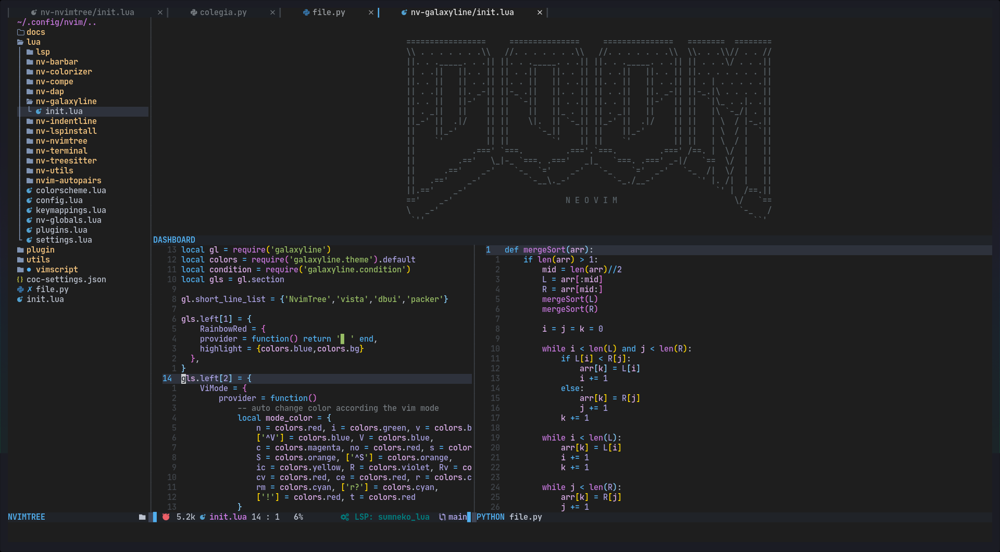

# doom-one.vim

> Come join the dark side

This colorscheme is ported from [doom-one](https://github.com/hlissner/emacs-doom-themes/blob/master/themes/doom-one-theme.el).

## Install

```Vim Plug
Plug 'GustavoPrietoP/doom-one.vim'
```

```Packer
use 'GustavoPrietoP/doom-one.vim'
```

``` Vundle
Plugin 'GustavoPrietoP/doom-one.vim'
```

## Screenshot



## TS Support

Rudimentary TS support is in place.
